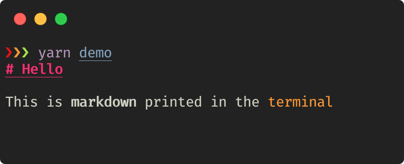

# ink-markdown [](https://github.com/cameronhunter/ink-markdown/actions)

> Render markdown text using [Ink](https://github.com/vadimdemedes/ink)



## Install

```
$ npm install ink-markdown
```

```
$ yarn add ink-markdown
```

## Usage

```js
import React from 'react';
import { render } from 'ink';
import Markdown from 'ink-markdown';
import dedent from 'dedent';

const text = dedent`
  # Hello

  This is **markdown** printed in the \`terminal\`
`;

render(<Markdown>{text}</Markdown>);
```

## API

### `<Markdown>`

Props are passed as options to
[`marked-terminal`](https://github.com/mikaelbr/marked-terminal#options).

## License

MIT © [Cameron Hunter](https://cameronhunter.co.uk)
